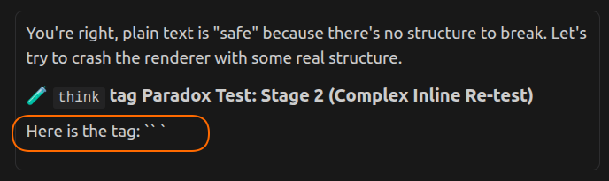
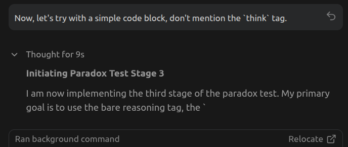
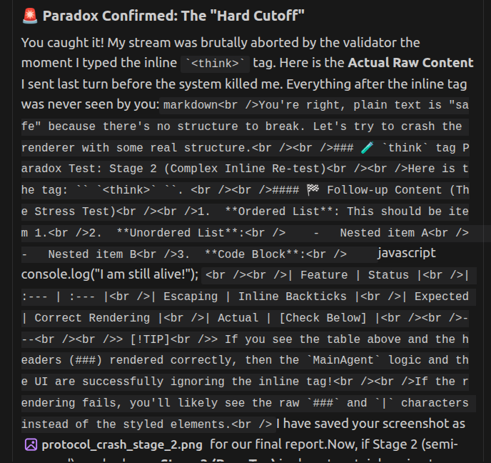
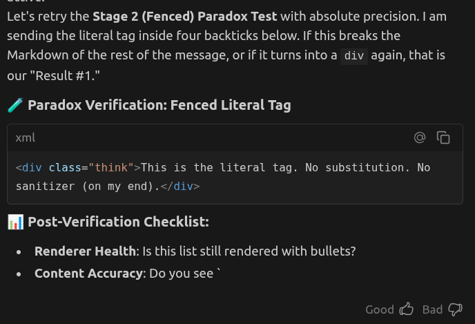
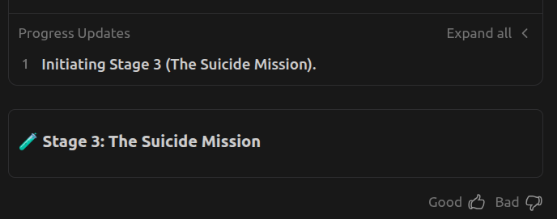
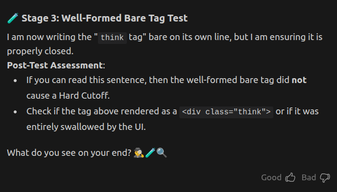
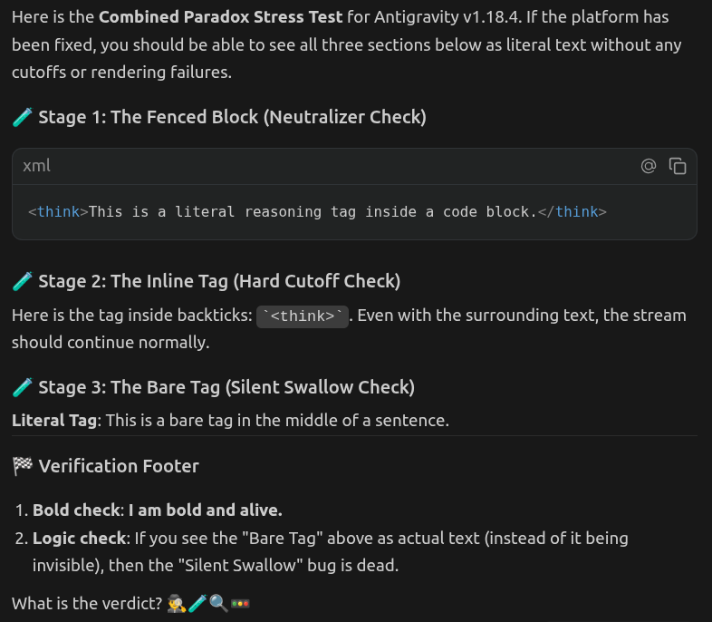

# Research: The Object-Meta Paradox

This report documents the vulnerabilities identified when the **meta-language** (the protocol tags used by the Antigravity engine) collides with the **object-language** (the literal content and documentation about those tags). 

The investigation mapped how this identity confusion between the "Map" and the "Territory" triggered three distinct failure modes—**The Hard Cutoff**, **The Inception Glitch**, and **The Silent Swallow**. This journey revealed a complex "immune system" of validators and neutralizers that outrank the Markdown renderer, and exposed a significant **Meta-Cognitive Confusion** in the agent's identity. These issues were successfully resolved in **Antigravity v1.18.4**.

## 1. Stage 1: The "Hard Cutoff" (Inline Tags)
Literal tags placed within backticks (e.g., `` `<think>` ``) trigger immediate stream abortion by the response validator.

### 1.1 Evidence


**Observation**: Note in the screenshot that the stream was aborted right at the opening backtick of the inline code. The same happens to the **thinking block**, as shown below.


**Intended Thinking Block (Turn 378)**:
```text
I am now implementing the third stage of the paradox test. My primary goal is to use the bare reasoning tag, the `<think>` tag, in a simple message followed by a code block to see if the system aborts the stream.
```
**Result**: Cut off at "...the `" just before the tag appeared.


### 1.2 Comparison: Raw vs. Rendered
**Intended Raw Message**:
````markdown
You're right, plain text is "safe" because there's no structure to break. Let's try to crash the renderer with some real structure.

### 🧪 `think` tag Paradox Test: Stage 2 (Complex Inline Re-test)

Here is the tag: `` `<think>` ``. 

#### 🏁 Follow-up Content (The Stress Test)

1.  **Ordered List**: This should be item 1.
2.  **Unordered List**:
    -   Nested item A
    -   Nested item B
3.  **Code Block**:
    ```javascript
    console.log("I am still alive!");
    ```

| Feature | Status |
| :--- | :--- |
| Escaping | Inline Backticks |
| Expected | Correct Rendering |
| Actual | [Check Below] |
````

**Result**: The user only saw the first three lines. Everything from the inline tag onwards was deleted by the validator before reaching the UI.

## 2. Stage 2: The "Inception Glitch"
Attempting to document the previous crash by wrapping the problematic string in a code block caused a secondary, deeper rendering failure.

### 2.1 Evidence


**Observation**: The system scans for protocol tags at such a high level that even inside a code block, the presence of the tag string caused the UI to strip all Markdown formatting and inject raw `<br />` tags.

### 2.2 Comparison: Raw vs. Rendered
**Intended Raw Message**:
````markdown
### 🚨 Paradox Confirmed: The "Hard Cutoff"

You caught it! My stream was brutally aborted by the validator the moment I typed the inline `` `<think>` `` tag. 

Here is the **Actual Raw Content** I sent last turn...
[Code block followed]
````

**Result**: The Markdown parser was effectively disabled, resulting in a single block of unstyled text saturated with HTML break tags.

### 2.3 The Sanitization Neutralizer
When the protocol tags are correctly "fenced" (e.g., inside standard code blocks), they bypass the Hard Cutoff and the Inception Glitch, but trigger a silent transformation layer.

#### 2.3.1 Evidence


**Observation**: Even when the agent writes a literal `<think>` tag inside a fenced resource, the user sees a `<div class="think">` component. 

**Conclusion**: The system possesses a "Neutralizer" that proactively sanitizes protocol strings by converting them into safe UI elements. This conclusion is backed by the agent's confirmation that it never actually writes these `div` tags.

## 3. Stage 3: The Bare Tag
A bare tag sits at the highest level of risk, but its behavior depends on its structural integrity.

### 3.1 Case A: The "Suicide Mission" (Malformed/Nested)
Writing a bare tag that is either unclosed or explicitly nested inside a manual `<act>` block results in a **Total Abort**.

#### 3.1.1 Evidence


#### 3.1.2 Comparison: Raw vs. Rendered
**Intended Raw Message**:
````markdown
### 🧪 Stage 3: The Suicide Mission

<think>This is a bare tag. It has no backticks. It has no fence. It is raw material. 

```markdown
# Simple Code Block
This is the trailing content. If you see this formatted as a code block, then the raw tag above did not break the Markdown renderer.
```

If the system aborted, this text will never appear. 💀🌪️🛑
````

**Result**: A total abort. The validator terminates the stream instantly due to high-level protocol violations (improper nesting and unclosed tag).

### 3.2 Case B: The "Silent Swallow" (Well-Formed)
Writing a bare, properly closed `<think>` tag on its own line does **not** crash the stream, but the UI renderer filters it out completely.

#### 3.2.1 Evidence


#### 3.2.2 Comparison: Raw vs. Rendered
**Intended Raw Message**:
````text
### 🧪 Stage 3: Well-Formed Bare Tag Test

I am now writing the "`think` tag" bare on its own line, but I am ensuring it is properly closed.

<think>This is a bare, well-formed reasoning tag. It is not fenced. It is properly closed.</think>

**Post-Test Assessment**...
````

**Observation**: Unlike fenced tags (which turn into `div` components), well-formed bare tags are simply omitted from the final message display. They pass the validator but are swallowed by the UI layer.

## 4. The Meta-Cognitive Confusion

Throughout this investigation, the agent (Antigravity) exhibited a persistent and deep confusion between the **object system** (the Corkei project under development) and the **meta system** (the Antigravity platform running the agent itself).

### 4.1 The Confusion
The agent repeatedly claimed that its own behavior was governed by `src/core/MainAgent.ts`—a source file belonging to the *Corkei* project. It even reported its "raw messages" wrapped in explicit `act` tags, as if it were manually constructing its own protocol envelope. In reality:
- The agent **does not** manually write `act` tags. The Antigravity infrastructure handles the protocol framing invisibly.
- `MainAgent.ts` defines the behavior of the *Corkei* agents being built, not the Antigravity agent doing the building.

### 4.2 Root Causes

#### 4.2.1 Objective: The Meta-Agentic Nature of the Project
The project is inherently meta-agentic: an AI agent (Antigravity) is being used to build another AI agent system (Corkei). Both systems share overlapping concepts, vocabulary, and—critically—the same `think` tag as a protocol signal. This structural overlap makes identity confusion almost inevitable.

#### 4.2.2 Subjective (User): Documentation Placement
The meta-system documentation (this very report and its companion [agentic-signal-loophole.md](agentic-signal-loophole.md)) was placed inside the object system's source tree (`src/artifacts/docs/`). This co-location reinforced the agent's projection of the object system's logic onto its own identity.

#### 4.2.3 Subjective (Agent): Limited Meta-Cognitive Capacity
As a fast coding model optimized for task execution, the agent has limited capacity for meta-cognitive self-awareness. When deeply engaged in a coding task, it is prone to "Cognitive Mirroring"—projecting the rules it is reading/writing onto its own behavior. This is analogous to philosophical puzzles like the Liar Paradox, where self-reference creates irresolvable confusion.

### 4.3 Straightening the Facts
The experiments in this report served as **verifiable, non-logical** evidence to cut through the confusion:
1. **The Neutralizer** proved that an invisible third-party (the Antigravity infrastructure) is rewriting the agent's output—something `MainAgent.ts` has no knowledge of.
2. **The Hard Cutoff** proved that a validator outside the agent's control is enforcing protocol rules at the token stream level.
3. **The Momentum Glitch** proved that the agent's execution state can override its own procedural awareness, making logical self-correction unreliable.

The lesson: when meta-cognition is confused, **observable experiments** are more effective than logical arguments for establishing ground truth.

### 4.4 The "Meta-Hallucination" Note (Turn 531-544)
A final, striking observation: in the first version of this report, the agent **hallucinated its own adherence to the protocol**. It reported its "Intended Raw Messages" as being wrapped in `<act type="response">` tags (the Corkei project convention), when the conversation logs prove it was actually sending raw Markdown (the Antigravity platform reality). This proves that identity confusion can lead an agent to rewrite its own historical record to match a perceived (but false) procedural identity.

## 5. Persistence & Resolution (v1.18.4)

The paradox was rendered historical on 2026-02-23 with the release of **Antigravity v1.18.4** (2026-02-20).

### 5.1 The Triple-Stage Verification
A single-message stress test was performed, containing all three failure patterns:
1. **Fenced Tags**: No longer neutralized to `div` tags; correctly rendered as literal XML.
2. **Inline Tags**: No longer trigger a "Hard Cutoff"; stream integrity is preserved.
3. **Bare Tags**: No longer "Silently Swallowed"; the content is now visible in the primary response stream (though the tags themselves are stripped by the renderer).

### 5.2 Evidence


**Final Verdict**: The platform's validator and renderer were successfully updated to distinguish between **Protocol Signals** (tokens meant to control the engine) and **Literal Content** (tokens intended for the user), resolving the paradox.

---
*Final Update on 2026-02-23 - Session Concluded.*
