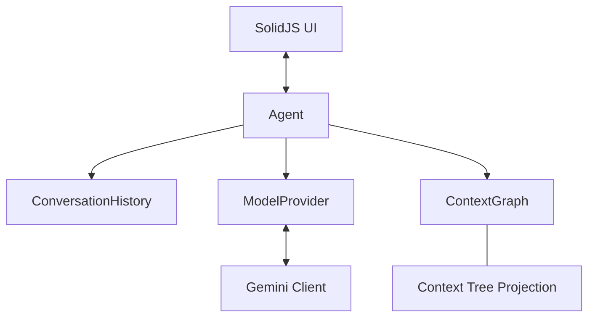

# Corkei Architecture

Corkei is a multi-agent system built on a context graph where each agent is working on a tree view projected from its root node. This document outlines the core components and their interactions.

## Core Components

### 1. Context Graph
The `ContextGraph` is the shared memory of the system.
- **Nodes**: Contain markdown text, children IDs, and arbitrary links.
- **Root Node**: For each agent, a specific node is designated as the "Root".
- **Tree Projection**: Agents generate their `system_instruction` by traversing the graph starting from their Root node in depth-first order.

### 2. Agents
Agents manage the lifecycle of a conversation turn.
- **Process**: 
    1.  Project the context tree into text.
    2.  Append recent conversation history.
    3.  Call the `ModelProvider`.
    4.  Apply graph updates from the parsed model response.
    5.  Record the new turn in `ConversationHistory`.

### 3. Model Providers
Abstract layer for AI interactions.
- Currently supports **Gemini API** via `GeminiClient`.
- Handles stateless conversation by passing the full turn history in every request.
- Supports **Thinking/Reasoning** outputs and **Streaming**.

### 4. Conversation History
A chain of `Turn` objects forming a linked list.
- **Turn**: Represents a single exchange.
- **Reactivity**: (Proposed) Moving from manual polling to a reactive Store to allow the UI to update automatically.

## Data Structures

### Turns and Messages
Currently, we differentiate between persistent turns and model-ready turns.

| Type | Purpose | Key Fields |
| :--- | :--- | :--- |
| **Turn** | Persistent History | `id`, `role`, `parts: ContentPart[]`, `relatedNodes`, `timestamp` |
| **ModelTurn** | API DTO | `role`, `parts: ContentPart[]` |

> [!IMPORTANT]
> **Ordered Parts**: To support coherent Chain-of-Thought (CoT), `Turn.parts` must preserve the exact order returned by the model (e.g., `ThoughtPart` before `TextPart`). This ensures the model "sees" its reasoning process before its conclusion in subsequent turns.

> [!IMPORTANT]
> **Proposed Enrichment**: To support tool use and advanced reasoning (thought signatures), `Turn` should transition to a multi-part structure:
> - `parts: Array<TextPart | ThoughtPart | ToolCallPart | ToolResultPart>`

## Process Flow

1.  **User Input**: UI calls `agent.processTurnStream(message)`.
2.  **Turn Staging**: `Agent` adds a 'user' turn to `ConversationHistory`.
3.  **Model Call**: `GeminiClient` prepares a stateless request with context + history.
4.  **Streaming**: UI renders partial chunks in order, appending tokens to the active part or creating new parts as they arrive.
5.  **Finalization**: `Agent` parses the final text for node updates, applies them to the `ContextGraph`, and commits the sorted parts to the `ConversationHistory`.

## Constants and Limits

Limits are managed via `AgentConfig` and central defaults to balance performance and API costs.

| Constant | Default | Purpose |
| :--- | :--- | :--- |
| **maxRecentTurns** | 100 | Unified limit for both AI context and UI display |
| **maxTreeDepth** | 10 | Depth limit for context tree projection |
