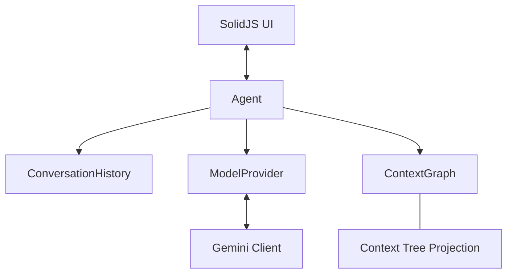

# Corkei Architecture

Corkei is a multi-agent system built on a context graph where each agent is working on a tree view projected from its root node. This document outlines the core components and their interactions.

## Core Components

### 1. Context Graph
The `ContextGraph` is the shared memory of the system.
- **Nodes**: Contain markdown text, children IDs, and arbitrary links.
- **Root Node**: For each agent, a specific node is designated as the "Root".
- **Tree Projection**: Agents generate their `system_instruction` by traversing the graph starting from their Root node in depth-first order.

### 2. Agents
Agents manage the lifecycle of a conversation turn.
- **Process**: 
    1.  Project the context tree into text.
    2.  Append recent conversation history.
    3.  Call the `ModelProvider`.
    4.  Apply graph updates from the parsed model response.
    5.  Record the new turn in `ConversationHistory`.

### 3. Model Providers
Abstract layer for AI interactions.
- Currently supports **Gemini API** via `GeminiClient`.
- Handles stateless conversation by passing the full turn history in every request.
- Supports **Thinking/Reasoning** outputs and **Streaming**.

### 4. Conversation History
A chain of `Turn` objects forming a linked list.
- **Turn**: Represents a single exchange.
- **Reactivity**: Implemented via **SolidJS Store**. Components react to granular updates (e.g., streaming chunks) without full list re-renders.
- **Persistence**: Automatically synced to `localStorage`. `ConversationHistory` hydrates from storage on initialization, ensuring continuity across sessions.

## Data Structures

### Turns and Messages
We use an enriched multi-part structure to preserve the exact order of model outputs.

| Type | Purpose | Key Fields |
| :--- | :--- | :--- |
| **Turn** | Persistent History | `id`, `role`, `parts: ContentPart[]`, `relatedNodes`, `timestamp` |
| **ContentPart** | Message Unit | `type: 'text' | 'thought'`, `content: string` |

> [!IMPORTANT]
> **Ordered Parts**: To support coherent Chain-of-Thought (CoT), `Turn.parts` preserves the exact sequence returned by the model (e.g., `thought` before `text`). This allows the model to "see" its reasoning in subsequent turns, improving consistency.

## Process Flow

1.  **User Input**: UI calls `agent.processTurnStream(message)`.
2.  **Turn Staging**: `Agent` immediately adds a 'user' turn to `ConversationHistory`.
3.  **Model Call**: `GeminiClient` prepares a stateless request with context + history.
4.  **Streaming & Reactivity**: 
    - `Agent` generates chunks and updates the `ConversationHistory` store.
    - SolidJS UI reacts to part changes (dot updates/text growth) in real-time.
    - To force reactivity for nested properties, `Agent` pushes deep clones of the `parts` array to the store.
5.  **Finalization & Persistence**:
    - `Agent` parses final text for node updates and applies them to `ContextGraph`.
    - `ConversationHistory.saveHistory()` is called at the end of the stream to commit the final state to `localStorage`.

## Constants and Limits

Limits are managed via `AgentConfig` and central defaults to balance performance and API costs.

| Constant | Default | Purpose |
| :--- | :--- | :--- |
| **maxRecentTurns** | 100 | Unified limit for both AI context and UI display |
| **maxTreeDepth** | 10 | Depth limit for context tree projection |
